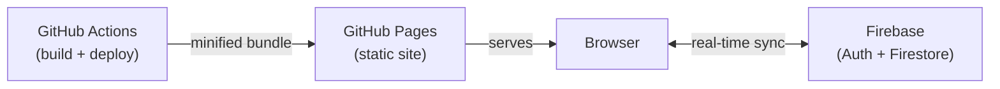

# Hope Raid Tracker

A raid management tool for TBC Classic guilds. Members sign up for raids and reserve loot. Officers manage rosters, approve requests, and track character progress — all from a shareable web link with no app install required.

## Features

**For members**
- Sign up for upcoming raids with your preferred role and character
- Soft reserve items per raid from a full loot browser filtered to your class
- View past raids and your signup history

**For officers & admins**
- Create raids with phase presets, run type (full/partial), and boss selection
- Approve or deny signup requests with one click
- Character audit with parse history and raid assignment controls
- Lock soft reserves per raid and set per-member limits
- Assign, bench, or unassign members from specific raids

**Platform**
- Real-time updates — no refresh needed
- Google, Yahoo, and email/password sign-in
- Responsive — works on desktop, tablet, and mobile
- Role-based access enforced server-side

## Architecture


```mermaid
flowchart LR
    gh["GitHub Actions\n(build + deploy)"]
    pages["GitHub Pages\n(static site)"]
    browser["Browser"]
    firebase["Firebase\n(Auth + Firestore)"]

    gh -->|minified bundle| pages
    pages -->|serves| browser
    browser <-->|real-time sync| firebase
```

## Role hierarchy

| Role   | Sign up | Soft Reserve | Manage raids | Approve signups | Change roles | Nuke accounts |
|--------|---------|-------------|--------------|-----------------|-------------|---------------|
| Member | ✅      | ✅ (own only) | ❌          | ❌               | ❌           | ❌             |
| Admin  | ✅      | ✅ (all)    | ✅           | ✅               | ✅ (member/admin) | ❌        |
| Owner  | ✅      | ✅ (all)    | ✅           | ✅               | ✅ (all)     | ✅             |

## TBC raid phases

- **Phase 1** — Karazhan, Gruul's Lair, Magtheridon's Lair
- **Phase 2** — Serpentshrine Cavern, The Eye
- **Phase 3** — Hyjal Summit, Black Temple
- **Phase 4** — Zul'Aman
- **Phase 5** — Sunwell Plateau

## Project structure

```
├── index.html               # Main signup page
├── admin.html               # Raid creator (admin only)
├── admin-operations.html    # Requests, audit, access management (admin only)
├── admin-softres.html       # Soft Reserves (all members)
├── js/                      # JavaScript source modules
│   ├── main.js              # Config loader (picks local vs prod by hostname)
│   ├── app.js               # Signup page logic
│   ├── admin.js             # Raid creator logic
│   ├── admin-operations.js  # Admin operations logic
│   ├── admin-softres.js     # Soft Reserves logic
│   └── nav-component.js     # Shared navigation bar
├── styles/
│   └── styles.css           # All styles (responsive breakpoints included)
├── firebase/
│   ├── firestore.rules      # Server-side security rules
│   └── firestore.indexes.json
├── config/
│   ├── local/               # Local dev config (gitignored)
│   └── prod/                # Production config (generated by CI)
├── data/                    # Static loot table JSON
├── assets/                  # Images and icons
├── scripts/                 # Maintenance and data scripts
├── build.js                 # Production build (obfuscate + minify → dist/)
└── .github/workflows/       # CI/CD — build and deploy to GitHub Pages
```

## Development

Vanilla JS (ES modules), no framework or bundler required at the source level.

```bash
python3 -m http.server 4173   # local dev server
npm run build                 # production build (obfuscate + minify → dist/)
npm run build:quick           # quick build (no obfuscation)
npm run serve:dist            # serve dist/ locally on port 4174
```

Copy `config/local/app-config.local.example.js` to `config/local/app-config.local.js` and fill in your Firebase config values to run locally. The local config is gitignored and never deployed.

Pushing to `main` triggers the GitHub Actions workflow, which injects secrets, builds to `dist/`, and deploys to GitHub Pages automatically.
