# Hope Raid Tracker

Static TBC Classic raid signup site for GitHub Pages with Firebase Auth + Firestore.

## Features

- Live shared raid signup board (create, edit, delete signups)
- Admin panel with raid creation (Phase 1–5 presets), signup request approval, and character audit
- Owner > Admin > Member role hierarchy with Firestore-enforced access control
- Soft ban and nuke account capabilities for owners
- Google sign-in authentication (anonymous auth rejected by rules)
- Auto-generated WoW Armory and Warcraft Logs links
- Responsive design for desktop, tablet, and mobile
- Production build with JS obfuscation + CSS/HTML minification

## Architecture

```mermaid
flowchart TB
    subgraph Browser["Browser (Client)"]
        direction TB
        main["main.js\n(config router)"]
        nav["nav-component.js\n(shared nav bar)"]

        subgraph Pages["Pages"]
            direction LR
            index["index.html\n+ app.js"]
            admin["admin.html\n+ admin.js"]
            ops["admin-operations.html\n+ admin-operations.js"]
        end

        main -->|localhost| localCfg["config/local/\napp-config.local.js"]
        main -->|production| prodCfg["config/prod/\napp-config.github.js"]
        localCfg --> fbCfg["firebase-config.js\n→ firebaseConfig + appSettings"]
        prodCfg --> fbCfg
        fbCfg --> Pages
        nav --- Pages
    end

    subgraph Firebase["Firebase (Spark Plan)"]
        direction TB
        auth["Authentication\n(Google Sign-In)"]
        fs["Cloud Firestore"]

        subgraph Collections["Firestore Collections"]
            direction LR
            raids["raids"]
            signups["signups"]
            characters["characters"]
            members["members"]
            admins["admins"]
            owners["owners"]
        end

        rules["firestore.rules\n(server-side enforcement)"]
        rules -.- fs
        fs --- Collections
    end

    subgraph CI["GitHub Actions CI/CD"]
        direction LR
        push["Push to main"] --> secrets["Inject GitHub\nSecrets → config"]
        secrets --> build["build.js\n(obfuscate + minify)"]
        build --> dist["dist/"]
        dist --> deploy["Deploy to\nGitHub Pages"]
    end

    Pages <-->|Firebase SDK v10\nESM via CDN| auth
    Pages <-->|realtime listeners\n+ CRUD ops| fs
    deploy -.->|serves static files| Browser

    subgraph Roles["Role Hierarchy"]
        direction LR
        owner["Owner 👑"] --> adminRole["Admin ⚔️"] --> member["Member 🛡️"]
    end

    rules -.- Roles
```



## Project structure

```
├── index.html               # Main signup page
├── admin.html               # Raid creator (admin only)
├── admin-operations.html    # Requests, audit, access management
├── app.js                   # Signup page logic
├── admin.js                 # Raid creator logic
├── admin-operations.js      # Admin operations logic
├── nav-component.js         # Shared navigation bar
├── main.js                  # Config loader (picks local vs prod config by hostname)
├── styles.css               # All styles (responsive breakpoints included)
├── build.js                 # Production build script (obfuscate + minify)
├── config/
│   ├── local/               # Local dev config (gitignored)
│   │   └── app-config.local.js
│   └── prod/                # Production config
│       ├── firebase-config.js       # Reads window.__HOPE_RAID_CONFIG
│       └── app-config.github.js     # Generated by CI from GitHub secrets
├── assets/images/           # Icons and images
├── firestore.rules          # Firestore security rules
├── firestore.indexes.json   # Composite indexes
└── .github/workflows/
    └── deploy-pages.yml     # GitHub Actions → build → deploy to Pages
```

## Cost safety

- Use Firebase **Spark** (free) plan only.
- Do not add a payment method or upgrade to Blaze.
- If quotas are exceeded, writes stop instead of billing.

## Setup

### 1) Create Firebase project

1. Go to [Firebase Console](https://console.firebase.google.com) and create a project.
2. Enable **Authentication** → Sign-in method → **Google**.
3. In **Authentication** → **Settings** → **Authorized domains**, add:
   - Your GitHub Pages host (e.g. `yourname.github.io`)
   - Any custom production domain
   - `localhost` (for local development only — see security note below)
4. Enable **Firestore Database** in production mode.
5. In Project settings → General → Your apps, create a Web app and copy config values.

### 2) Local development

1. Copy `config/local/app-config.local.example.js` to `config/local/app-config.local.js`
2. Fill in your Firebase config values and admin UIDs.
3. Serve locally:
   ```bash
   python3 -m http.server 4173
   ```

The local config file is gitignored and never deployed.

### 3) Deploy Firestore rules + indexes

```bash
npm install -g firebase-tools
firebase login
firebase use --add
firebase deploy --only firestore:rules,firestore:indexes
```

Or paste rules/indexes manually in the Firebase Console.

### 4) GitHub Pages deployment (CI)

The included workflow (`.github/workflows/deploy-pages.yml`) automatically:
1. Generates `config/prod/app-config.github.js` from GitHub secrets
2. Runs `npm run build` to produce obfuscated + minified output in `dist/`
3. Deploys `dist/` to GitHub Pages

**Required GitHub secrets** (Settings → Secrets and variables → Actions → Secrets):
- `FIREBASE_API_KEY`
- `FIREBASE_AUTH_DOMAIN`
- `FIREBASE_PROJECT_ID`
- `FIREBASE_STORAGE_BUCKET`
- `FIREBASE_MESSAGING_SENDER_ID`
- `FIREBASE_APP_ID`

**Optional GitHub variables** (Actions → Variables):
- `APP_SITE_TITLE` (default: "Hope Raid Tracker")
- `APP_ADMIN_UIDS` (comma-separated UIDs)
- `APP_DISCORD_INVITE_URL`

### 5) Set up roles

**Owner** (highest privilege — can assign admins, owners, and nuke accounts):
1. Create a Firestore document at `owners/<YOUR_UID>` with any fields.
2. The owner also needs docs in `admins/<UID>` and `members/<UID>`.

**Admin** (can manage raids, approve signups, change member roles):
1. Create `admins/<UID>` and `members/<UID>` docs in Firestore.
2. Or use the Character Audit dropdown on the admin operations page once you are an owner.

**Member** (can sign up for raids):
1. Create `members/<UID>` doc in Firestore.
2. Or approve via the admin operations page.

## Build commands

```bash
npm run build          # Full production build (JS obfuscation + CSS/HTML minify)
npm run build:quick    # Quick build (copies JS as-is, only minifies CSS/HTML)
npm run serve:dist     # Serve dist/ locally on port 4174
```

Build output goes to `dist/` (gitignored). The CI workflow runs `npm run build` automatically.

## Role hierarchy

| Role   | Sign up | Manage raids | Approve signups | Change roles | Assign owners | Nuke accounts |
|--------|---------|-------------|-----------------|-------------|---------------|---------------|
| Member | ✅      | ❌           | ❌               | ❌           | ❌             | ❌             |
| Admin  | ✅      | ✅           | ✅               | ✅ (member/admin) | ❌        | ❌             |
| Owner  | ✅      | ✅           | ✅               | ✅ (all)     | ✅             | ✅             |

## Firestore collections

| Collection   | Purpose                        |
|-------------|--------------------------------|
| `raids`     | Raid events                    |
| `signups`   | Player signups for raids       |
| `characters`| Player character profiles       |
| `members`   | Approved member UIDs           |
| `admins`    | Admin UIDs                     |
| `owners`    | Owner UIDs (highest privilege) |

## Security notes

- **localhost in authorized domains**: Safe for development. An attacker would need your Firebase config values AND a user who visits their malicious localhost page. In practice this is negligible risk for a guild site. Remove it in production if you want maximum hardening (see "Locked production setup" below).
- Local config (`config/local/`) is gitignored and excluded from both `dist/` and the CI deploy bundle.
- Firestore rules enforce role checks server-side — client-side admin checks are just UI gates.
- The build script never copies `config/local/` to `dist/`.

## Locked production setup

For maximum security on a production Firebase project:

1. In **Authentication → Settings → Authorized domains**, remove `localhost` and `127.0.0.1`.
2. Keep only your production domain(s).
3. Enable Firebase App Check for additional abuse protection.
4. Periodically audit the `admins` and `owners` collections.

## TBC Phase raid presets

- Phase 1: Karazhan, Gruul's Lair, Magtheridon's Lair
- Phase 2: Serpentshrine Cavern, The Eye
- Phase 3: Hyjal Summit, Black Temple
- Phase 4: Zul'Aman
- Phase 5: Sunwell Plateau
